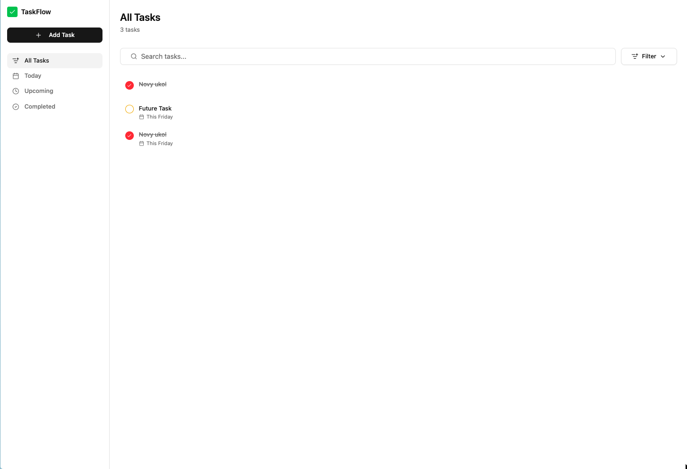
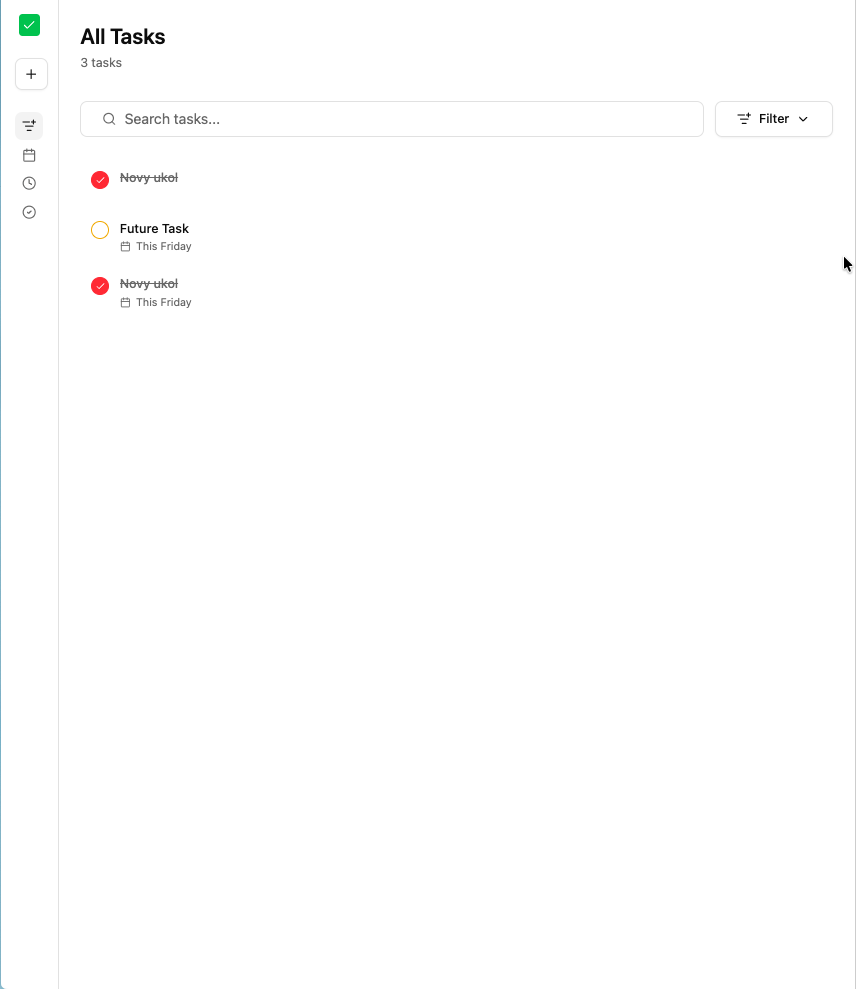
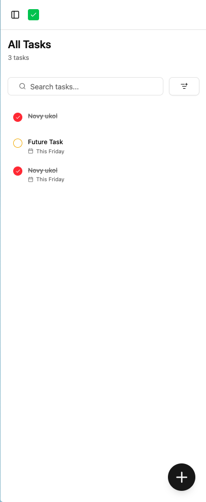
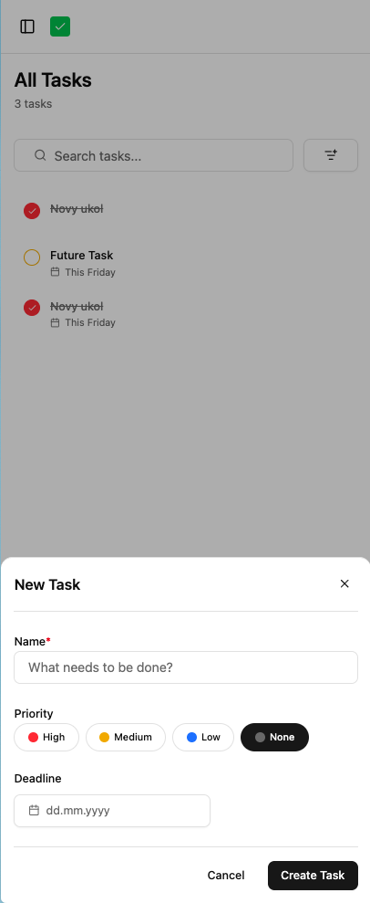
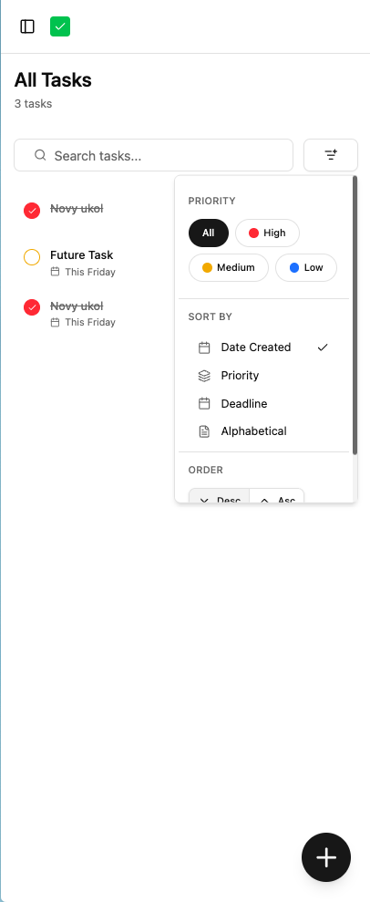

# TaskFlow

A clean, responsive task management application built with modern Angular and AI-assisted development.

**[Live Demo](https://simple-todolist.janzimola.com/)**

## Tech Stack

| Technology         | Purpose                                          |
| ------------------ | ------------------------------------------------ |
| **Angular 21**     | Latest stable version with Signals               |
| **Tailwind CSS 4** | Utility-first styling                            |
| **ZardUI**         | shadcn/ui-inspired component library for Angular |
| **Lucide Angular** | Icon library                                     |
| **RxJS**           | Reactive state management with Observables       |
| **AutoAnimate**    | Smooth list animations (add/remove/reorder)      |
| **Vitest**         | Unit testing                                     |
| **Docker + nginx** | Containerized deployment                         |

> **Note:** The architecture is intentionally kept simple for this junior-level project scope. No complex state management libraries or over-engineered patterns.

---

## Screenshots

### Desktop



### Tablet & Mobile

| Tablet                            | Mobile                            | Create Task                                        | Filtering                                           |
| --------------------------------- | --------------------------------- | -------------------------------------------------- | --------------------------------------------------- |
|  |  |  |  |

---

## Development Process

This project was built using an AI-assisted workflow with Claude Code, focusing on efficiency and leveraging modern tooling:

### 1. Research Phase

Gathered LLM context files (`context/angular.txt`, `context/zardu-llm.txt`) from the official Angular and ZardUI documentation websites. These files provided Claude with the necessary knowledge about available APIs, components, and patterns.

### 2. Component Library Setup

Used Claude to import and configure ZardUI components, then built showcase pages accessible at `/dev` routes. This allowed testing components in isolation with various states and edge cases before integrating them into the main application.

### 3. App Elements Design

Generated UI prototypes using Claude's React/web capabilities, then provided screenshots of these prototypes to guide the implementation of Angular-specific components. Components were built incrementally based on known requirements.

### 4. Domain Modeling

Defined the `Task` model and `TaskService` API with a reactive approach:

- `Task` interface with id, title, completed, priority, deadline, dateCreated
- `TasksFilter` for view, priority, search, and sorting options
- Service using `BehaviorSubject` for reactive state with Observable streams

### 5. Homepage Implementation

Built the main interface iteratively with manual adjustments for responsiveness across desktop, tablet, and mobile breakpoints. Small improvements were made throughout to ensure quality UX.

### 6. Deployment

Initially attempted direct build on Coolify, but server resources were insufficient for the Angular build process. Solution: Created a GitHub Actions workflow to build the Docker image and push to GitHub Container Registry (GHCR), then deployed the pre-built image on Coolify.

---

## Features

### Core Requirements (All Completed)

- **Create tasks** - Title with validation (cannot be empty), optional priority and deadline
- **Display task list** - Reactive rendering via Observable stream
- **Toggle completion** - Visual distinction for completed tasks (strikethrough, muted colors)
- **Delete tasks** - With confirmation dialog
- **In-memory state** - Managed via Angular service with `BehaviorSubject`

### Bonus Features (6/6 Completed)

| Bonus               | Implementation                                                         |
| ------------------- | ---------------------------------------------------------------------- |
| **Filtering**       | Views: All, Today, Upcoming, Completed + Priority filter + Text search |
| **Task Editing**    | Edit title, priority, deadline via responsive modal/sheet              |
| **LocalStorage**    | Tasks persist across page refreshes                                    |
| **Routing**         | Development routes at `/dev/*` for component showcase                  |
| **Unit Tests**      | Comprehensive `TaskService` tests with Vitest                          |
| **Angular Signals** | Used extensively with RxJS interop (`toSignal`, `toObservable`)        |

### UX Polish

| Feature                  | Description                                                                 |
| ------------------------ | --------------------------------------------------------------------------- |
| **List Animations**      | Smooth fade/scale animations when tasks are added, removed, or reordered    |
| **Mobile Tap-to-Reveal** | On mobile, tap a task card to reveal edit/delete actions (checkbox toggles) |
| **Dark Theme Support**   | System/Light/Dark theme toggle with localStorage persistence                |

---

## Running the Project

### Prerequisites

- Node.js 22+
- npm 11+

### Development

```bash
# Install dependencies
npm install

# Start development server (http://localhost:4200)
npm start
# or
ng serve

# Run unit tests
npm test

# Build for production
npm run build
```

---

## Docker Deployment

### Local Docker Build

```bash
# Build the image
docker build -t taskflow .

# Run the container
docker run -p 80:80 taskflow
```

### Coolify Deployment

This project uses GitHub Actions to automatically build and push Docker images to GitHub Container Registry.

1. **GitHub Actions Workflow** (`.github/workflows/build.yml`):
   - Triggers on push to `main`/`master`
   - Builds the Docker image
   - Pushes to `ghcr.io/<username>/taskflow:latest`

2. **Coolify Setup**:
   - Create a new Web Service
   - Select "Docker Image" as the source
   - Use image: `ghcr.io/<your-username>/taskflow:latest`
   - Configure port 80
   - Enable redeploy on image update

The Dockerfile uses a multi-stage build:

- **Stage 1**: Node 22 Alpine - builds the Angular app
- **Stage 2**: nginx Alpine - serves the static files with SPA routing support

---

## Project Structure

```
src/app/
├── core/
│   ├── models/          # Task, TasksFilter interfaces
│   ├── services/        # TaskService with reactive state
│   └── utils/           # Date formatting utilities
├── components/          # App-specific components (TaskCard, TaskForm, etc.)
├── shared/
│   ├── components/      # ZardUI component library
│   └── core/directives/ # AutoAnimate and other directives
├── pages/
│   ├── home/            # Main application page
│   └── [dev pages]/     # Component showcase routes
└── layout/              # Shell component for dev routes
```

---

## Links

- **Live Demo**: [simple-todolist.janzimola.com](https://simple-todolist.janzimola.com/)
- **ZardUI** (inspiration): [ui.shadcn.com](https://ui.shadcn.com/)
- **Angular**: [angular.dev](https://angular.dev)
- **RxJS**: [rxjs.dev](https://rxjs.dev)

---

## License

This project was created as a submission for a junior Angular developer position.
